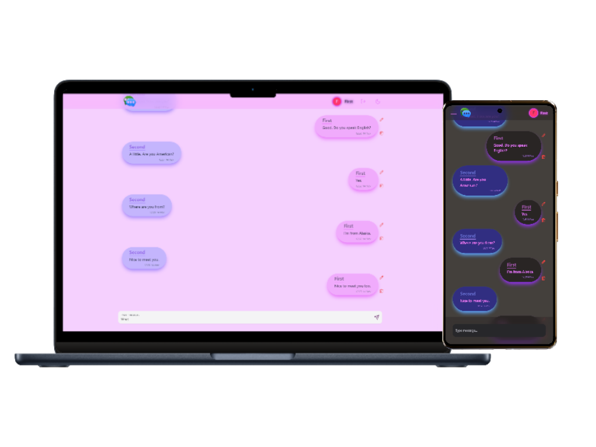

# Chatversation with React + TypeScript + Appwrite + TailwindCSS + Vite

#### Brief Description:

This is a chat application built using React, TypeScript, Appwrite, TailwindCSS, and Vite. It allows users to sign up, sign in, and create communities. Once logged in, users can view a list of communities and join them. Within a community, users can chat with each other in real-time. The app also provides features for updating and deleting messages, as well as creating and updating communities.
Overall, this app provides a social platform for users to connect and communicate with each other.

#### Set environment variables:

1. Create a .env.local file in the root of the project.
2. Add the following environment variables to the .env file:
   - VITE_APPWRITE_URL: "The endpoint for your Appwrite project"
   - VITE_APPWRITE_PROJECT_ID: "The ID of your Appwrite project"
   - VITE_APPWRITE_DATABASE_ID: "The ID of your Appwrite database"
   - VITE_APPWRITE_CHATBOX_COLLECTION_ID: "The ID of your Appwrite collection"

click here to visit => [_**Chatversation**_](https://chatversation.vercel.app/)

    

        
    

